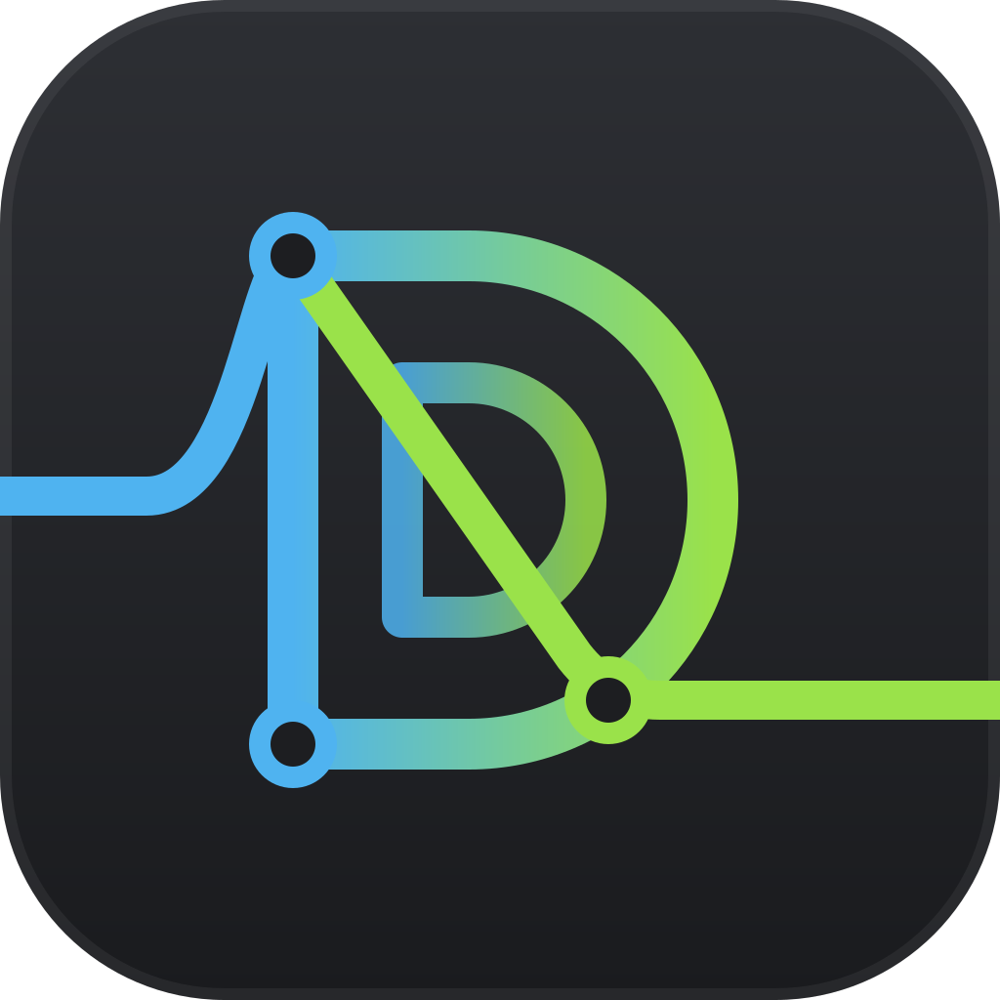

#  Dermixen

Dermixen is a desktop app for macOS and Linux for building a continuous DJ mix in the studio. You scan your music once, put analyzed tracks on a timeline, get a beatmatched transition between each pair, adjust the transitions by ear, and render the whole mix to one WAV or MP3 file. It is inspired by MixMeister and is not a live performance tool.

The app has two front doors, and both drive the same engine:

- `dermixen` is the command. It scans folders into [the library](docs/library.md), which is everything Dermixen has learned about your tracks and is kept in one file in your data folder. It queries the library, builds a mix document, renders the mix, and plays it. Every command prints JSON behind `--json`, so a script or an agent can drive the app without a window.
- `dermixen-app` is the window. It opens a mix document, or an untitled empty mix when you name no document, as a timeline with the waveforms, the mix tempo curve, the anchors that place each transition, and the volume and EQ curves of every track, with the library in a panel beside them.

What you hear in the window is what a render writes, because preview and render are one code path.


## Prerequisites

- `rust-toolchain.toml` names the toolchain the workspace builds with, and `rustup` installs it on the first cargo command. The window needs at least Rust 1.95, because it is built on `eframe` 0.36.
- A C and C++ compiler, and `make`. The build compiles three vendored libraries (the Signalsmith stretcher, the aubio beat tracker, and libkeyfinder) from source, and builds the LAME MP3 encoder with its own configure script and `make`. On macOS, the Xcode command line tools provide all of them.
- On Linux, the ALSA development headers, which the build needs for audio output: the `libasound2-dev` package on Debian and Ubuntu.

## Build

```
cargo build --release --workspace
```

The two executables land in `target/release/`: `dermixen` and `dermixen-app`. `dermixen open` starts the window from the folder that contains the command, so keep the two together. The window is slow in a debug build, so build it with `--release`.

`scripts/check.sh` runs the formatting check, the lints, and every test in the workspace. Continuous integration runs those three on Linux and macOS, and `cargo deny check` against `deny.toml`, for every push to `main` and every pull request. That check covers licenses, security advisories, dependency bans, and dependency sources.

## The starter library

The window builds its first library from `~/Music/Undefunktis` when it opens and finds no library file. That folder is empty until `scripts/install-starter-tracks.sh` puts five tracks by Undefunktis there, about 70 megabytes in all. The script checks each download against a SHA-256 digest recorded in the script itself and deletes and reports a download that does not match. The tracks are by [Undefunktis](https://undefunktis.bandcamp.com/) and are licensed under the [Creative Commons Attribution-NonCommercial-ShareAlike 4.0 license](https://creativecommons.org/licenses/by-nc-sa/4.0/), which is their license and not the app's. The folder is the `music_folder` setting, so it can name any folder instead.

```
scripts/install-starter-tracks.sh
```

## Opening a mix from the desktop

On macOS, `scripts/bundle-macos.sh` makes `target/Dermixen.app`, and you can drag that to your Applications folder. On Linux, `scripts/install-linux-desktop.sh` installs the desktop entry, the MIME type, and the app icon for you. On macOS and on Linux, double-clicking a `.dmx` file opens the window on that mix. On macOS, dropping a `.dmx` file on the Dermixen icon does the same, and a file you open while the window is up replaces the mix in that window. The window asks what should become of unsaved changes before it takes the new mix, when the mix it holds has any.

## Make a mix

Scan a folder of tracks, put two of them in a mix, and render it. Substitute your own folder and two tracks of your own at a similar tempo.

```
cd ~/Music/goa
dermixen library scan comp
dermixen mix new set.dmx
dermixen mix add set.dmx "comp/VA - Orbital Gardens [ORBCD02]/03 Helix Nine - Lantern Fish.mp3"
dermixen mix add set.dmx "comp/VA - Signal Bloom [SGNL011]/07 Marrow Circuit - Tidewater.mp3"
dermixen render set.dmx set.mp3
dermixen open set.dmx
```

The scan analyzes each track once, at about three seconds per track, and writes the results to the library file in your data folder. `mix add` reads each track's tempo, beat grid, anchors, and loudness from the library, joins the track to the one before it with an eight-bar beatmatched transition, and prints the timeline. `render` writes the mix to a 320 kbps MP3 when the name ends in `.mp3`, and to a 16-bit WAV (44.1 kHz, stereo) with any other name. `open` shows the mix in the window. [Your first mix](docs/tutorials/your-first-mix.md) walks through the same steps with the output of each.

## Documentation

The documentation is in `docs/`, arranged by what you're trying to do, and published at [mmacy.github.io/dermixen](https://mmacy.github.io/dermixen/). [The documentation home page](docs/README.md) lists every page.

- Tutorials, to learn by doing: [Your first mix](docs/tutorials/your-first-mix.md) and [Editing a mix in the window](docs/tutorials/editing-a-mix-in-the-window.md).
- How-to guides, one task each: scanning your music, finding tracks, building a mix from a tracklisting, checking and changing a transition, fixing a beat grid, leveling the tracks, relinking moved files, driving the app from a script, and building from source. They're listed on [the documentation home page](docs/README.md#how-to-guides).
- Reference, the facts about each part: [the `dermixen` command](docs/cli.md), [the window](docs/window.md), [the library](docs/library.md), [the project file](docs/project-file.md), and [the scoreboard's ground truth](docs/ground-truth.md).
- Explanation, how and why the app works the way it does: [How a mix fits together](docs/explanation/how-a-mix-fits-together.md), [What you hear is what renders](docs/explanation/what-you-hear-is-what-renders.md), [How analysis is trusted](docs/explanation/how-analysis-is-trusted.md), and [The command and agents](docs/explanation/the-command-and-agents.md).

`DESIGN.md` is the specification the app is built to, including what it deliberately leaves out. `PLAN.md` is the working method, and `CLAUDE.md` is the guidance for the agents that build the app.

## Checking the work

Correctness is shown by things that run, not only by reading the code. `cargo test --workspace` runs the acceptance tests, including golden renders that compare the engine's output against stored audio. `dermixen play --capture` writes the frames the audio device would play, and a render of the same span writes identical samples, which is how the rule that preview equals render is checked from the command line. `dermixen scoreboard` measures every analyzer against annotated tracks and prints a table, so analyzer quality is a number rather than an opinion. [How analysis is trusted](docs/explanation/how-analysis-is-trusted.md) describes the scoreboard and the correction loop behind it.

## License

Dermixen is licensed under the GNU General Public License, version 3 or any later version. `LICENSE.md` holds the license text.

Copyright (C) 2026 Marsh Macy

The starter tracks are not part of the app and have their own license, named under "The starter library" above.
