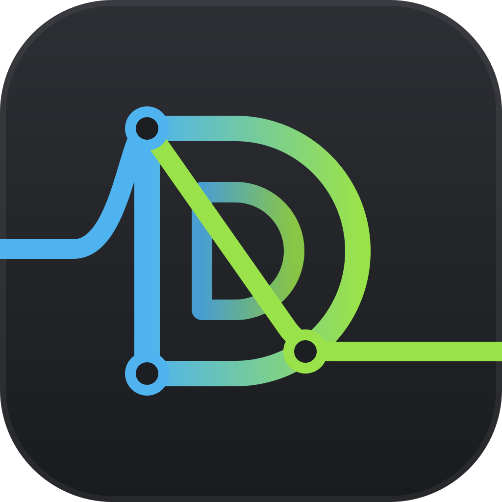
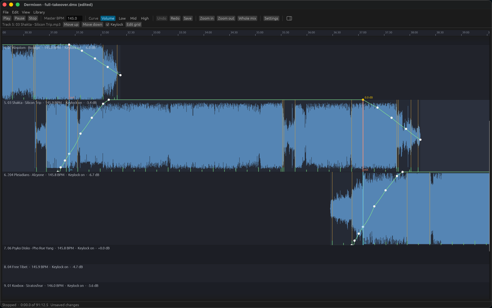

#  Dermixen documentation

Dermixen is a desktop app for macOS and Linux for making DJ mixes. You put tracks on a timeline, Dermixen beatmatches each transition, and you adjust the transitions by ear. Then Dermixen renders the set to one WAV or MP3 file. If you've used MixMeister, the workflow will feel familiar.



Dermixen also has a [command-line interface (CLI)](cli.md), so an AI agent running in Claude Code or Codex can build a mix for you. Describe the set you want, and the agent picks tracks from your collection, orders them, and places the transitions. Then it opens the mix in the Dermixen window for you to fine-tune.

```text
Create a new mix. I want it around 140 BPM, 1996-1997, ~90 minutes long, on the darker side, something a DJ would play between midnight and 3AM, a peak psychedelia set at a Goa party. Open the mix in the app when you're done.
```

You don't need decks or a controller, and the result is a file you can share. Dermixen is free and open source under the GPL, version 3 or later.

Start with a tutorial if you're new to Dermixen, a how-to guide when you have a task in hand, an explanation page for how the app works and why, and a reference page for the facts about a command or a control.

## Tutorials

- [Your first mix](tutorials/your-first-mix.md): scan a folder, put two tracks in a mix, render the transition, and listen to it.
- [Editing a mix in the window](tutorials/editing-a-mix-in-the-window.md): open the mix, play it, move an anchor, add a track from [the library](library.md), and save.

## How-to guides

- [Scan your music](how-to/scan-your-music.md)
- [Find tracks for a mix](how-to/find-tracks-for-a-mix.md)
- [Build a mix from a tracklisting](how-to/build-a-mix-from-a-tracklisting.md)
- [Check a transition by ear](how-to/check-a-transition-by-ear.md)
- [Change a transition](how-to/change-a-transition.md)
- [Fix a beat grid](how-to/fix-a-beat-grid.md)
- [Level the tracks](how-to/level-the-tracks.md)
- [Relink moved files](how-to/relink-moved-files.md)
- [Drive Dermixen from a script](how-to/drive-dermixen-from-a-script.md)
- [Measure the analyzers on your own corrections](how-to/measure-the-analyzers.md)
- [Build from source](how-to/build-from-source.md)

## Explanation

- [How a mix fits together](explanation/how-a-mix-fits-together.md): the playlist, the anchors, the one tempo curve, the volume and EQ curves, and why a transition is nothing but nodes.
- [What you hear is what renders](explanation/what-you-hear-is-what-renders.md): one render path for preview and render, and what the app does to never lose work.
- [How analysis is trusted](explanation/how-analysis-is-trusted.md): the scoreboard, the baselines, confidence, and the correction loop.
- [The command and agents](explanation/the-command-and-agents.md): why the command is a front door and how an agent builds a mix through it.

## Reference

- [The `dermixen` command](cli.md): every command, its options, its output, and its exit codes.
- [The `dermixen-app` window](window.md): what the timeline shows, the mouse, the controls, the beat grid editor, the library panel, the keyboard, saving, and the autosave file.
- [The library](library.md): what Dermixen knows about your tracks, the file that contains it, scanning, tags and file names, queries, finding a track from text, and the Camelot wheel.
- [The project file](project-file.md): every field of a `.dmx` file, the transition presets, and the errors.
- [Settings](settings.md): the settings file, where it is, and every setting with its default.
- [Ground truth for the scoreboard](ground-truth.md): the annotation formats and what each scoreboard number means.
- [Test fixtures](fixtures.md): the three tiers of audio the tests use.
- [The JSON schema](json/dermixen.schema.json): the shape of every command's `--json` output.
- [Tools](https://github.com/mmacy/dermixen/blob/main/tools/README.md): the Python programs beside the app, including the MixMeister playlist reader.

`DESIGN.md` at the root of the repository is the specification, and `PLAN.md` is the working method.
