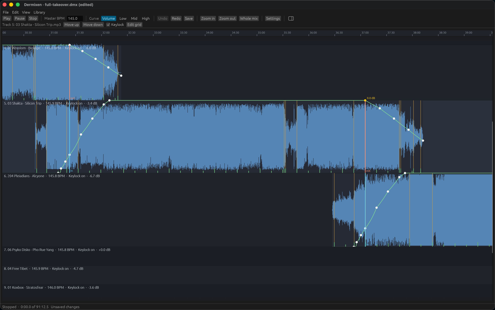
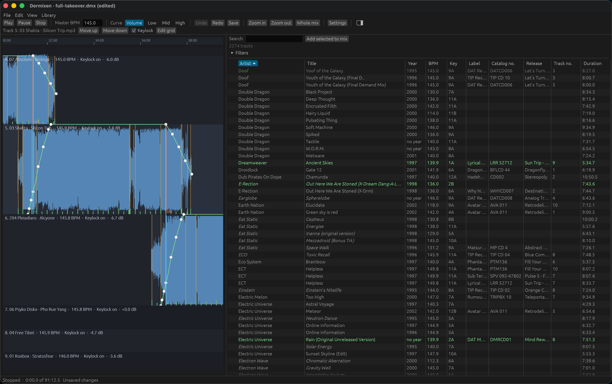

# The dermixen-app window

`dermixen-app` is the graphical front door to Dermixen. It opens one mix document, or an untitled empty mix when you name no document, and shows the playlist as the timeline: the waveforms, the mix tempo curve, the anchors, the per-track volume and EQ curves, and the phrase starts and section changes analysis found, with the library beside them unless the library panel is hidden. You play the mix from any point, move the playhead, drag an anchor or a node while it plays and hear the result, add a track from the library, correct a track's beat grid by ear against a metronome, reorder the playlist, and undo any of it.

The window is a shell over the engine and the view-models. Everything it plays as a mix comes from the same render path `dermixen render` writes and `dermixen play` plays, so what is heard in the window is what a render of the mix contains. The one thing it plays that is not the mix is the grid editor's audition, which plays one track's own frames at the track's own speed, since a grid is judged against the track rather than against the mix.

## The command

```text
dermixen-app [MIX]
```

`MIX` is a mix document, which by convention ends in `.dmx`. `docs/project-file.md` describes the format. The window opens, and the command returns when the window closes.

The window reads a mix document of at most 16777216 bytes, which is 16 MiB, and it reads a regular file only. A path that names a device, a named pipe, a folder, or a symbolic link to any of those is refused with one line saying that the path is not a regular file, and so is a file over that size, with the limit in bytes in the line. The same rule holds wherever the window reads a document: the file you name on the command line, the file **Open...** gives it, a `.dmx` file you open on the desktop, and an autosave file. Double-click a symbolic link to `/dev/zero` named `set.dmx` and the window answers with that one line rather than reading the link until the machine runs out of memory.

With no `MIX` the window opens on an untitled empty mix, which is what starting Dermixen from the desktop without a mix document does. **File > Save** then asks you where to write it. From your first edit until you save it, the window keeps the mix in the untitled autosave file "The autosave file" below describes.

The window prints one line on standard error for the mix it opens: `Opened` and the path of the mix, or `Opened an untitled mix`. It prints such a line again whenever **New** or **Open...** puts another mix under the window, and again when you open a `.dmx` file on the desktop and the window puts that mix there.

`dermixen-app --help` prints the usage and exits with code 0. The exit codes otherwise match the `dermixen` command as `docs/cli.md` describes them: 0 when the window opened and closed, 1 when the mix could not be read or is not a mix document, with one line beginning `error:` on standard error saying which, and 2 when the command line could not be read, which is more than one argument. The window also exits with code 1 when it cannot read the settings file. That `error:` line names the settings file and what is wrong, and the line the problem is on when the file has one, which a file the operating system refuses to read does not. The window reads the settings file before it opens on the mix, and `docs/settings.md` describes the file.

Building the window needs a Rust compiler of version 1.95 or newer, which is what `eframe` needs.

## Opening a mix from the desktop

Double-clicking a `.dmx` file on the desktop opens the window on that mix. `README.md` says how to install the application bundle on macOS and the desktop entry on Linux.

The app icon is `packaging/icon/dermixen.svg`. The macOS bundle carries it as `Dermixen.icns`, the Linux installer puts it in your icon theme, and the window itself shows it in the title bar, the dock, and the task bar. `scripts/make-icon.sh` renders every one of those files from the SVG, so a change to the icon is a change to that one file followed by a run of the script.

On Linux the desktop entry passes the file to `dermixen-app` as its argument, so the window opens on that mix the way it opens on a mix named on the command line.

On macOS the file never reaches the command line. The system starts the application bundle with no argument and sends the running process the open-documents Apple event naming the file. Dropping a `.dmx` file on the Dermixen icon sends the same event. Dermixen listens for that event before the event loop starts. It has to listen that early, because the system sends the event for the document the bundle was started to open while the application is still finishing its launch, when the window does not exist yet.

A double-click that starts Dermixen therefore shows an untitled empty mix for a moment, with its `Opened an untitled mix` line, and then the mix from the file you opened, with its own `Opened` line. The window opens the file by the route **File > Open...** takes: it asks what should become of unsaved changes first when the mix under the window has any, it prints its `Opened` line for the file, and it leaves a file that is no mix document out of the window with the reason in the status line. One window holds one document, so of the files one event names the window reads the last and leaves the rest: each of the others would be replaced at once by the file after it, and a drop of a thousand files on the icon would hold the window up while it read them all. A `.dmx` file you open while the window is up replaces the mix in that window rather than opening a second one. A file you open while the window is asking about unsaved changes, or while it is offering an autosave back, waits until you have answered, and the window opens the file then.

## The title

The window's title is `Dermixen`, a middle dot, and the name of the mix, which is the file name of the mix document or `Untitled` for a mix that has never been saved. While the mix has changes that were never saved the title ends in ` (edited)`, from the first edit after a save until the next save. A **Save as...** or a save of an untitled mix puts the name of the file you chose in the title, and **New** and **Open...** put the new mix's name there.

## The library file

The library file is the one SQLite file that contains everything Dermixen has learned about the tracks it scanned, as `docs/library.md` describes. The window reads two things from that file. The first is the phrase analysis of each track of the mix, looked up by content hash, which is what puts the phrase starts and the section changes on the lanes. A track the library does not contain gets no phrase marks, and its bar lines are counted from beat zero of its own grid rather than from a detected downbeat. The second is every track the library contains, which is what the library panel beside the timeline shows. The window reads the panel's tracks when it opens a mix, and again as a scan adds tracks.

The phrase marks of a mix are looked up once, when the window opens that mix, so a mix you open while the first scan is still running gets no phrase marks for the tracks the scan has not reached yet. Opening the mix again, once the scan is further on or over, puts those marks on the lanes.

Which library file the window opens: the `DERMIXEN_LIBRARY_FILE` environment variable, else the `library_file` setting, else `dermixen/library.sqlite` in your data folder, which is `~/Library/Application Support` on macOS and `~/.local/share` on Linux. An empty value for the variable is the same as no variable. That is the same file the `library` commands and `mix add` open, after their own `--library` option, which the window does not take. `docs/settings.md` describes the setting, and the settings dialog has a field for it. A relative path in the variable is read against the folder the window was started in, as the `dermixen` command reads it, so the window reports the file in full and opens that one file wherever it was started from.

The window makes the library file, and the folders above it, when the file is not there. A folder the window makes for itself is read, written, and entered by you alone, which is mode 0700 on macOS and Linux, and that holds for the folder of the library file, the corrections folder, and the folder of the untitled autosave file. A folder that is already there keeps the permissions it has, whoever made it: the `dermixen` folder in your data folder is one the `dermixen` command may have made first, with the permissions your machine gives a new folder. The autosave file itself is read and written by you alone whatever folder it lands in. The window works the library file out again, and makes it again when it has to, for every mix it puts under itself, so a `library_file` setting you change in the settings dialog takes effect the next time you open a mix or start a new one. A user with no data folder gets a status line message and no library at all, because the default library file lies below that folder. A user with no home folder gets the same message only when the `library_file` setting is a relative path, since the home folder is what such a path is worked out below. The music folder's default lies below the home folder too, so a user with no home folder opens a library as usual and is told, when a scan starts, that the music folder cannot be worked out.

A library file the window has just made is empty, so the window scans your music folder into it, which is "The first scan" below. A library file that was already there starts no scan.

A row the library cannot read costs you that row and not the panel. A row whose values are damaged, such as text that is not UTF-8 or a number no mix document would hold, is left out of the panel and counted, and the status line says how many rows could not be read and that **Library > Scan music folder** replaces them, since a scan reads each file again and writes its record afresh. Every other track is in the panel as usual.

A library file that cannot be opened or read at all leaves the panel empty, with the reason in the status line. The thread that reads the tracks opens the same file for the phrase analysis and reports its own failure, `No phrase marks are shown:` and the reason, so one file that cannot be opened puts two messages in the status line: one for the empty panel and one for the phrase marks. A lookup that fails for a single track is reported as `No phrase marks are shown for` the track's path and the reason.

The window writes two things to the library. Relinking a track points the library at the file the window placed the track on, as `dermixen mix relink` does, so the window opens the library file for writing while it looks for the files of a mix. A scan writes the record of every track it analyzes.

## The first scan

When the window makes the library file, and your music folder is there, the window scans that folder into the new library on a thread of its own. The timeline, the transport, and every control go on working while the scan runs, and the tracks appear in the library panel as they land. Each refresh of the panel reads the whole library, so on a library of thousands of tracks the window pauses for a moment as the panel takes the new records, which it does at most once a second. That is how a first launch after a build or an install ends with a library.

Your music folder is the `music_folder` setting, and `Music/Undefunktis` below your home folder when the setting is unset. When that folder is not there, the window scans nothing and the status line says that the library is empty, names the folder the window looked for, and tells you to choose a music folder in the settings dialog and then choose **Library > Scan music folder**.

The scan enters every folder below the music folder, and it has no list of folders to leave out, so a mix you rendered into a folder below your music folder joins the library as a track. `dermixen library scan --exclude` is the way to leave a folder out, and `docs/cli.md` describes the option.

The scan is the one `dermixen library scan` runs, with the same analyzers, so the window and the command build the same records. The window resolves the links along your music folder before the scan starts, as the command does, so a folder reached through a symbolic link is stored under one spelling whichever of the two scans reads it, and the other scan then finds those tracks unchanged rather than moved. A folder the operating system cannot resolve is reported with the reason, in place of the scan. `docs/library.md` describes what a scan does with each file.

## Reading the mix

The window reads every track's file on a thread of its own, in playlist order, so a long track never holds up a repaint. Each track's waveform overview is worked out as its file is read, at a bucket of 441 frames, which is a hundredth of a second. A lane whose overview has not arrived yet is drawn without a waveform and fills in when it does. A track added from the library is read the same way once it is in the mix, after whatever the thread was already reading, so its lane fills in a few seconds after it appears. A track whose file the window has already read is not read again, and a track the window has no file for is not read at all.

Before any of that reading starts, the window reads and hashes every track's file, which is what tells a file that has been replaced from the file the document names. That pass runs on a thread of its own, so the window opens at once, the timeline and every control work while it runs, and the status line says `Looking for the tracks' files` until it is done. A mix of lossless files takes a few seconds, and the lanes have no waveforms until the pass ends, because the reading of the files begins with what the pass found. Every track whose file is not where the document says, or is not the file the document names, is looked for by its hash in the library during the pass, as `dermixen mix relink` looks without folders.

Every document that comes under the window is read this way: the one the window opens with, the one **New** or **Open...** brings in, a `.dmx` file you open on the desktop, and the autosaved document you restore. Each of them gets the pass first and the reading of the files after it, so a track is read at the file the pass found rather than at the path the document named before.

A track the library can place is pointed at the file the library names, the mix counts as changed so that a save keeps the new path, and the status line says which tracks were relinked. Nothing else about the document changes. The undo history stands, so the command key with Z takes back the edit it would have taken back before, and the new path stays through an undo and a redo, since a path is where a file is rather than an edit you made. The selection, the view, and an audition that is playing stand too. The beat grid editor closes when the pass points its own track at another file, because what the editor shows was read from the file that track has left, and it stays open otherwise. A track you edited while the pass ran keeps its path, since the window takes only what the pass found for a track that still has the path the pass looked at. The window points the library's record for a relinked track at that file as well, so the window opens the library file for writing while the pass runs. A `dermixen library scan` running in another process at the same time keeps the library file to itself, and the pass then stops, with the reason SQLite reported in the status line and a note that not every track was looked for.

A track the library cannot place keeps its path, and its lane says which of three things is wrong with its file. It says `the file is missing` when there is no file at that path, `the file has changed` when a file is there whose content hash is not the track's, and `the file cannot be read` when a file is there that the operating system will not open, as an unmounted volume or a permission leaves it. The status line says which of the three it is and names the tracks. For a file that is missing or has changed it names `dermixen mix relink`, which searches folders you name, and for a file that cannot be read it gives the reason the operating system gave instead, since mounting the volume or changing the permission is the remedy for that one. A preview that reaches such a track stops with the reason. The window leaves such a track out of the reading, since there is no file to read, so the status line goes on naming the command rather than reporting a file that could not be read.

With no library file there is nowhere to look for a file that has moved, so no track is relinked, and the same is true of a library file the window cannot open. Every track's file is read and hashed all the same, so a lane still says what is wrong with its file and the status line still names `dermixen mix relink` for a file that is missing or has changed.

The window compares what it decoded with what the document names. Every track's file is hashed as it is decoded, and a file whose hash is not the one the document gives for that track is another recording, or the same recording encoded again. The window throws away what it decoded from such a file and treats the file as it treats a missing one: the lane says `the file has changed` in place of the waveform, nothing of that file is kept for the preview to play, and the status line says that the file at that path is not the track the document names and points at `dermixen mix relink`. The comparison is made wherever the window decodes, which is the thread that reads the mix's files, the beat grid editor, and the preview, so the answer is the same whichever of the three reaches the file first.

The decoded audio of up to four tracks is kept, which is room for the two tracks of a transition and the two around them. A track the render has already asked for outranks one only read ahead, so a move of the playhead or an edit handed to the preview costs no second read of a file already in hand.

## What the timeline shows

One lane per track, in playlist order, then the mix tempo lane beneath them, a ruler above them, the library panel to their right unless the panel is hidden, and a status line at the foot of the window. A lane nobody has resized is fitted to the height of the window, between 44 and 120 pixels tall. Dragging a lane's bottom edge makes that one lane anywhere from 44 to 600 pixels tall, and the lanes below it move down, which is how you make a waveform tall enough to place an anchor or a node by eye. A lane keeps the height a drag gave it for as long as the window is open, and no file records it. A height belongs to the track rather than to the position, so it follows the track when the playlist is reordered, and two lanes whose tracks are the same file share one height: dragging the edge of either lane resizes both. A mix whose lanes come to more than the window has room for gets a scroll bar at the right of the lanes, which is dragged rather than turned with the wheel, because the wheel belongs to the timeline.



Each track lane shows:

- Its position in the playlist, its file name, its original tempo, whether keylock is on, and its gain with its sign, along the top. The lane of a track the window has no audio for says `the file is missing`, `the file has changed`, or `the file cannot be read` there, in place of a waveform.
- Its waveform, over the stretch of the timeline the track's audio covers. The rest of the lane is darker, so a gap between two songs is plain to see.
- A faint line at every bar. Bars are four beats of the track's own grid, counted from the downbeat the phrase analysis gives, or from beat zero when the library contains no phrase analysis for the track. They are left out altogether when they would come closer together than sixteen pixels, so zooming in brings them back.
- A green tick at the foot of the lane at every phrase start, drawn taller the longer the phrase, so the sixteen and thirty-two bar boundaries a transition lands on stand out from the shorter ones.
- An amber line across the lane at every section change.
- The intro anchor as a blue line marked `in`, and the outro anchor as an orange line marked `out`.
- The selected curve as a line across the track, with a dot at each of its nodes. The selected node also shows its level in decibels.

The mix tempo lane shows the curve the whole mix follows, with a dot at each node and that node's tempo written beside it. The lane covers the lowest and the highest tempo on the curve with two beats per minute of room either side, and its label says that range.

The playhead is a white line down every lane. The ruler is marked in minutes and seconds, at whatever spacing leaves its labels far enough apart to read.

## The mouse

In the lanes:

- A press within six pixels of a node of the selected curve, on both axes, takes hold of that node. Dragging it left or right moves it to the nearest whole beat of its track. Dragging it up or down changes its level.
- A press within six pixels of an anchor's column takes hold of that anchor and drags it to the nearest whole beat. The tracks after it slide along the timeline as it moves, because the overlap the anchors define is what places them.
- A press within four pixels of a lane's bottom edge, above or below, takes hold of that edge, and dragging it up or down makes the lane 44 to 600 pixels tall. The lanes below move as the drag goes, and the lane keeps its height when you let go. A node, an anchor, or a tempo node within six pixels of the press comes first, even when it belongs to the lane on the other side of the edge, so a node at silence, which is drawn on its lane's bottom row, is still what a press on that row takes. A double-click within those four pixels makes the lane 600 pixels tall, or 44 pixels tall when the lane is already 600, and the lanes below move with it. A node, an anchor, or a tempo node comes before the edge for a double-click too, so a double-click on a node at silence resizes nothing. A resize changes no mix. A resize adds nothing for undo to walk back and leaves the selection as it was.
- A press on a track's curve line where there is no node adds one there. A press on a track whose selected curve has no nodes at all places its first.
- A press on a track anywhere else selects the track.
- In the tempo lane, a press takes hold of a tempo node, or adds one on the curve's line at the nearest whole mix beat.
- A press below every lane takes hold of the tempo lane's bottom edge when the press is within four pixels of that edge, and does nothing otherwise. A press above the first lane does nothing.

The pointer says what lies under it: a hand over a node, a horizontal resize arrow over an anchor, and a vertical resize arrow over a lane's bottom edge and for as long as an edge is being dragged.

A drag is drawn as it happens, with the whole mix laid out again around the held node or anchor, so the effect of a move is visible before it is committed. The move becomes one undoable edit when you let go, and only if the position changed, so a plain click never nudges what it selected. A move the document refuses, such as a node dragged onto another, leaves everything as it was.

A click on the ruler moves the playhead there and makes that moment the start point. A preview that is playing moves there and plays on. A paused one moves there and stays paused. One that has played the mix out moves there and is left paused, so a click after the end moves the playhead without starting playback. A preview that gave up plays nothing, and a window with no preview running has nothing to move, so in both of those the playhead and the start point are all that move.

The wheel over the lanes scrolls the lanes up and down. A two-finger sideways swipe on a trackpad scrolls the timeline through the mix in time. The command key or the alt key with the wheel narrows or widens the view around the pointer, as two fingers pinching do. The command key or the alt key with shift and the wheel scrolls the timeline through the mix in time. The view is never narrower than one second nor wider than the mix plus a minute, and never starts before the mix.

## The menu bar

A menu bar runs across the top of the window with four menus.

| Menu | Items |
| --- | --- |
| **File** | **New**, **Open...**, **Save**, **Save as...**, **Quit** |
| **Edit** | **Undo**, **Redo**, **Settings...** |
| **View** | **Zoom in**, **Zoom out**, **Whole mix**, and **Show library** or **Hide library**, whichever applies |
| **Library** | **Scan music folder**, **Stop scan** |

Each item that has a control of the same name below the menu bar does what that control does. **Show library** and **Hide library** do what the library panel's toggle in the first row of controls does, though the toggle shows an icon rather than a name. **New**, **Open...**, **Save as...**, **Quit**, **Scan music folder**, and **Stop scan** have no control of their own.

**New** puts an untitled empty mix under the window. **Open...** asks the operating system for a mix document, through the file dialog of your machine, filtered to `.dmx` files, and puts the mix in the file you chose under the window. Both ask what should become of unsaved changes first, as "Saving" below describes, and a file dialog you cancel changes nothing. A file that is not a mix document leaves the mix under the window where it is, with the reason in the status line.

When **New** or **Open...** puts a mix under the window, the window sets that mix up as it set up the mix it opened on: it looks in the library for every track whose file has moved, it has the reading thread read the tracks that are new to this window, it gives the lanes every waveform and phrase mark already in hand, it marks the tracks of the new mix in the library panel, it fits the view to the new mix, and it offers back the autosave file of that mix when there is one to offer. The history of edits, the preview, and the beat grid editor of the mix before are dropped, and a preview that was playing stops.

**Undo** and **Redo** are greyed when there is nothing to undo or redo. **Settings...** opens the settings dialog "The settings dialog" below describes.

**Scan music folder** scans your music folder into the library the window has open, and **Stop scan** stops a scan that is running. "Scanning from the window" below describes both.

| Keys | Item |
| --- | --- |
| Command with N | **New** |
| Command with O | **Open...** |
| Command with S | **Save** |
| Command with shift and S | **Save as...** |
| Command with Q | **Quit**, except on macOS, where it quits at once |
| Command with Z | **Undo** |
| Command with shift and Z | **Redo** |
| Command with comma | **Settings...** |
| Command with the equals sign | **Zoom in** |
| Command with the minus sign | **Zoom out** |
| Command with 0 | **Whole mix** |
| Command with shift and L | **Show library** or **Hide library**, whichever the menu is showing |

On Linux the control key stands in for the command key, and the menu shows the keys of the machine it is running on.

On macOS the command key with Q never reaches the window. macOS gives every application a menu of its own with a **Quit** item on those keys, and that item ends the application without the question about unsaved changes and without the window hearing anything. What protects your work there is the autosave file, which contains every committed edit but the one in progress, and the next launch offers it back. **File > Quit** asks, on either machine, and so does the control key with Q on Linux.

## The controls above the timeline

**Play** starts the preview at the playhead, or resumes one that is paused. A preview that gave up keeps nothing worth resuming, so **Play** ends it and starts a fresh one at the start point. **Pause** holds the position, keeping what has been rendered ahead so that resuming costs no wait. **Stop** ends the preview, gives the audio device back, and returns the playhead to the start point.

The start point is the frame the preview last started from, and it is what makes stopping and playing again play the same stretch again, as a studio tool is expected to. **Play** records it whenever it starts the preview, and a click on the ruler sets it to the moment clicked. Playing after the mix has played out returns to the start point rather than to the beginning of the mix, unless the mix no longer reaches that frame, in which case it starts at the beginning. Pausing leaves the start point alone, because a pause is a position to come back to rather than a stretch to hear again.

**Master BPM** shows the mix tempo at the playhead and takes a tempo typed into it.

Every field in the window that takes a tempo (this one, the **Tempo** of a selected tempo node, and the **Tempo** of the beat grid editor) follows one rule. What was typed is written once, when you finish, by pressing return or by clicking away, so that a turn of a control is one undoable step rather than one per keystroke. A field clicked into and left alone writes nothing, and neither does a field whose text is still the tempo it showed when the typing began, so that retyping a number the field itself had rounded adds nothing to the history. Text that will not read as a positive tempo is refused, the field goes back to the tempo it was showing, and the status line says what was refused. A tempo that arrives while you are typing (the mix tempo moving under the master field as the preview plays, or a tap changing the grid editor's tempo) waits until the typing is over rather than being written under your fingers.

What **Master BPM** writes is two nodes on the mix tempo curve, both just ahead of the frame the render has already produced, which the window tells the timeline on every repaint. The first node sits at the first whole mix beat at or after that frame plus a tenth of a second, at the tempo the curve already has there, which pins the curve: everything before it, including everything you have already heard, is left exactly as it was. The second node sits one beat later, at the new tempo, so the mix ramps to it over that one beat and continues from there. Writing ahead of the render this way is what lets the preview carry on from the position rather than starting over, and the tenth of a second is room for the render to advance between the repaint that read the frame and the edit itself. With no preview running, the playhead's own frame stands in for the render's, so the two nodes land just ahead of the playhead.

To end a tempo excursion, move the playhead further on and type the tempo the mix should come back to, which writes another pair.

**Tempo** appears beside the master tempo field only while a tempo node is selected, and shows that node's own tempo. A tempo typed into it moves that node to that tempo, keeping its beat, when you finish editing the field. This is how a tempo is set exactly rather than by dragging the node. The node the tempo goes to is settled when the typing begins, not when it finishes, so typing a tempo and then clicking another node changes the node that was typed for and leaves the one that was clicked alone.

**Volume**, **Low**, **Mid**, and **High** choose which of the four per-track curves every lane shows and every press edits. Each is drawn in a color of its own.

**Undo** and **Redo** walk the history of edits. Every drag, every added node, every removed node, every grid correction, every reorder of the playlist, every keylock change, every track added from the library, and every turn of the master tempo control is one step.

**Save** writes the mix back to the file it was opened from. See "Saving" below.

**Zoom in**, **Zoom out**, and **Whole mix** move the view without the wheel. **Whole mix** widens the view until it covers the whole mix and puts its left edge at the start, which is where the window opens.

**Settings** opens the settings dialog, which "The settings dialog" below describes.

The library panel's toggle is the last control of the row, after **Settings**, and it stands in that one place whether the panel is hidden or shown. Its icon is the outline of a window with a vertical line dividing off the right third, and that third is filled while the panel is shown and empty while the panel is hidden. Its hover text reads **Hide library** or **Show library**, with the keys that do the same thing in parentheses. Clicking the toggle takes the panel away or brings it back. "The library panel" below describes the panel.

## The controls for the selected track

Selecting a track, a node of one, an anchor of one, or one of its tempo nodes brings up a second row naming that track.

**Move up** and **Move down** move the track one place in the playlist. Reordering the playlist reorders the mix: the lanes swap places, the tracks after them slide along the timeline, and the transitions between them are the ones the new order gives. The moved track stays selected at its new position, so it can be moved several places in a row.

**Keylock** turns pitch preservation on or off for the track. A track with keylock uses the pitch-preserving stretcher when the window was built with it, and plain resampling otherwise, in which case the status line says so and the pitch moves with the speed.

**Edit grid** opens the beat grid editor for the track.

## The beat grid editor

The editor works on a copy of one track's grid, and every adjustment takes effect on the track the moment the gesture that made it ends. The timeline, the audition, and the correction file all show the grid as it stands, and nothing waits for a button. The whole correction counts as one step of the mix's history however many adjustments went into it, so one **Undo** takes the track back to the grid the correction began on. `DESIGN.md` requires manual beat grid correction in the user interface and says the fix must be pleasant, because no detector is perfect.

While the editor is open, the command key with Z takes back one adjustment of the correction rather than the whole correction, and the editor stays open. An adjustment is one nudge, one arrow key press, one drag across the strip, one halving or doubling, one tap that gives a tempo, or one tempo typed in. The command key with shift and Z makes an adjustment that was taken back again. The track keeps the grid the command key with Z or the command key with shift and Z leaves, and the mix's history goes on keeping the correction as the one step **Undo** takes back. Pressing the command key with Z once for each adjustment you made takes the grid back to the one the editor opened on, and holding the key down walks back through the adjustments one repeat at a time, as a held arrow key nudges the grid once per repeat. The editor keeps every adjustment made since it opened, however many there are. A gesture that left the grid where it was, like a click on the strip, a drag that ended where it began, or a tempo the grid already has, is no adjustment, and the command key with Z takes back the adjustment before such a gesture instead. An adjustment made after taking one back drops what could have been made again.

**Edit > Undo**, **Edit > Redo**, and the **Undo** and **Redo** controls above the timeline walk the mix's own history while the editor is open, as they do when no editor is open. Undoing or redoing the correction that way puts the track's grid into the editor as well, and the strip and the metronome then follow that grid. The editor drops the adjustments it could have taken back, because each one of them described a grid the track no longer has, so the command key with Z has nothing to take back until you adjust the grid again.

The editor is a row of controls with a strip beneath it. The strip shows the track's own waveform, with the grid's beats drawn over it as vertical lines: the beat that starts a bar in yellow, and the other three beats of the bar in grey. This is the track alone, at its own speed, not the track as the mix plays it, because a grid is judged against the track and not against the mix.

The editor belongs to the row of controls for the selected track, so selecting another track, or none at all, hides it, **Stop track** with it, and selecting its own track again brings all of it back exactly as it was. An audition already playing goes on playing meanwhile, since it is the track that is being judged and not the screen. The space bar stops that audition without selecting its track again, and selecting its track again is how you reach **Stop track** itself.

The controls:

- **Nudge** slides the grid earlier or later, in milliseconds, dragged or typed. It is an offset applied on top of wherever the grid already sits rather than a reading of where the grid is, so it starts at zero every time the editor opens and a drag across the strip leaves it where it is.
- **Halve tempo** and **Double tempo** fix an octave error, which is a grid at half or at twice the true tempo. Beat zero stays where it is.
- **Tempo** takes an exact tempo typed in, by the rule every tempo field in the window follows, which "The controls above the timeline" gives.
- **Tap** counts taps in time with the music and reports a tempo once there are four or more, the tempo being sixty divided by the mean interval between consecutive taps. A pause of more than two seconds starts the count again. The count so far is shown beside the button.
- **Play track** and **Stop track** audition the track, described below.
- **Metronome** turns the click on the beats on and off. What the metronome is set to is kept for as long as the window is open, so opening the editor on another track keeps the click as you left it. The metronome starts as the settings file says, which is off where the file sets nothing.
- **Hide strip** collapses the strip, leaving the row of controls alone, and then reads **Show strip**, which brings the strip back at the height it had, showing the part of the track it was showing. Every control, the arrow keys, the audition, and the metronome go on working while the strip is collapsed. Whether the strip is collapsed is the setting `grid_strip_collapsed`, which the window writes as soon as the control is clicked, so the editor opens on any track as you left it and stays that way the next time the window opens. The settings dialog shows the same setting.
- **Close** closes the editor. The correction stays on the track, since every adjustment was made there as it happened. Closing stops the audition and gives the audio device back, and it ends the correction, so a correction made after the editor is opened again is an undoable step of its own.

### The strip

The strip takes the same gestures the timeline does. The wheel moves the view through the track. The command key with the wheel, or two fingers pinching, narrows or widens it around the pointer, down to one frame of audio per pixel, which is where a drag of one pixel moves the grid by one frame. The view is never narrower than that and never wider than the whole track, and it opens showing the whole track.

A press on the strip takes hold of the grid, and dragging left or right slides every beat by the frames the pointer crossed, measured from where the press began rather than from the last position reported, so a slow drag and a fast one over the same distance move the grid by the same amount. Beat zero may end up before the first frame of the track, which is what a track whose first beat the analyzer placed too late needs. The track gets the dragged grid when you let go.

A press let go before the pointer has travelled two pixels is a click on the strip rather than a drag, and the grid stays where it was. The click moves the strip's playhead to the frame under the pointer. When the track is playing, the window moves the audition to that frame, keeping the grid and the metronome setting the audition already has, so the track plays on from there without the audio device stopping. Pointing at a passage is how you hear it. When nothing is playing, **Play track** starts from that frame.

The strip is drawn without a waveform until the track's audio is in hand. The window usually already has it, because it keeps the decoded audio of up to four tracks. When the window does not have the audio, it reads the file on a thread of its own and the waveform appears when the read is done, with the beat lines and every control working the whole time.

The strip is 140 pixels tall when the window opens. A line across the window under the strip marks the strip's bottom edge. Dragging that line up or down makes the strip anywhere from 44 to 600 pixels tall, the range a lane of the timeline is dragged over, and the pointer shows a vertical resize arrow over the line and for as long as the line is dragged. The line sits under the strip rather than over its last rows, so a press that resizes the strip never slides the grid and a press on the strip never resizes it. The height belongs to the window rather than to one editor, so closing the editor and opening it on another track keeps it, and it lasts for as long as the window is open. No file records it.

**Hide strip** takes the strip away and **Show strip** brings it back, as "The beat grid editor" above describes. A collapsed strip takes no gesture at all. A strip hidden after it was shown comes back at the height and the view it had, and goes on following the audition's playhead if it was following one. An editor opened while the strip is collapsed has never had a strip to measure, so its strip shows the whole track when it is first shown, with the playhead wherever the audition has reached by then.

### The audition

**Play track** plays the track on its own, at its own speed, with a click on every beat of the grid as it stands. `DESIGN.md` asks for this under "Manual beatgrid correction": a grid is only known to be right when the click is heard to land on the kicks, and dragging the grid while the track plays is how you put it there.

The space bar does what **Play track** and **Stop track** do for as long as the editor is open, starting the audition when none is running and stopping the one that is running. An audition the space bar starts stops a preview of the mix that is playing, as one **Play track** starts does, and the status line says so. A held space bar acts once, on the first press of the key, so holding it down does not start and stop the audition over and over. The space bar works while the editor's controls are hidden, which is while another track is selected, so stopping an audition that way does not mean selecting its track again.

The grid the metronome clicks on follows every change made to it (a drag across the strip, a nudge, an arrow key press, a halved or doubled tempo, a tap, a tempo typed in), and the change is heard from the next frame the audio device takes, so the click lands on the kicks as the grid is dragged under it.

**Metronome** is turned on and off at any moment, whether the track is playing or not and whether the grid is being dragged or not. What the metronome is set to belongs to the window rather than to one editor, so it stands from one audition to the next and across opening the editor on another track. The window writes the choice to the settings file as soon as the checkbox is clicked, so the metronome is as you left it the next time the window opens, and the settings dialog shows the same setting.

The audition starts at the playhead the strip is showing, which is where the last audition of this track reached, or where the last click on the strip put it. It starts at the frame at the left edge of the strip when the strip shows no playhead, which happens because none has played yet, because the last one played the track out, or because the view has been moved somewhere the playhead is not. Clicking the passage in question, or scrolling the strip to it and pressing **Play track**, is how you hear one particular part of a track.

While the audition runs, the strip follows its playhead: a playhead that runs off the right edge turns the page, putting itself at the left edge of the next screenful. Moving the view by hand ends that following, because scrolling or zooming while the track plays means you want to look at the place you moved to. From then on the strip stays where you put it and the playhead runs off it, until the next **Play track** starts the following again.

The machine has one audio output, so an audition and the mix cannot both have it. Starting an audition stops the mix, and the status line says so. Starting the mix stops the audition, and the status line says that too. An audition that plays the track out gives the device back on its own. An audition whose device stopped taking frames stops, and the status line says why.

An editor open on a track whose position in the playlist changes under it (because a track was removed or moved, or because an undo or a redo moved one) is closed, its audition is stopped, and the status line says why. The editor keeps its track's content hash as well as its position, which is what makes that possible.

## The library panel

The panel to the right of the timeline shows every track the library contains, which the window reads when it opens a mix and again as a scan adds tracks. Above the table stand the search field, **Add selected to mix**, a count of the rows showing, and a **Filters** section that is closed when the window opens. The panel's left edge is dragged to make it wider or narrower.



### Hiding the panel

One control hides the panel and brings it back: the toggle at the right end of the first row of controls above the timeline, after **Settings**, which is there whether the panel is hidden or shown. "The controls above the timeline" above describes its icon and its hover text. **View > Hide library**, **View > Show library**, and the settings dialog's **Library hidden** checkbox do the same thing.

Hiding the panel takes the whole panel away, so the timeline has the width of the window. Nothing of the panel is left: no search field, no filters, no table, no count, and **Add selected to mix** goes with them. egui keeps the width of a panel for as long as the window is open, so the panel comes back at the width it had, and a window that has not shown the panel yet opens it 800 pixels wide. No file records the width, so every window starts from those 800 pixels. The window reads the library file when it opens whether the panel is hidden or shown, and keeps the rows and the key they are highlighted against up to date while the panel is hidden, so the panel comes back with nothing to wait for and with the highlighting right for the track selected on the timeline.

Whether the panel is hidden is the setting `library_collapsed`, which the window writes as soon as the toggle, the **View** menu item, or the settings dialog's checkbox is clicked, so the panel is as you left it the next time the window opens. The settings dialog shows the same setting. When the window cannot write the settings file, the panel is as you set it for as long as the window is open, and the status line gives the reason.

### The table

One row stands for one track. The columns, left to right, are **Artist**, **Title**, **Year**, **BPM**, **Key**, **Label**, **Catalog no.**, **Release**, **Track no.**, and **Duration**. Before them is a narrow column with no heading, which marks a track that is already in the mix with a dot. Each of the ten headed columns has a divider after it, and dragging a divider makes the column on its left wider or narrower. Double-clicking a divider makes the column on its left as wide as its widest cell, as a spreadsheet does. The widest cell is measured over every row the panel gives the table, not only the rows on screen, and the heading with its sort arrow counts as a cell. A divider runs the whole height of the table, so the double-click lands anywhere along it.

Whether a cell wraps its text is the setting `library_word_wrap`, which the settings dialog's **Wrap library cells** checkbox changes and which is off until you turn it on. While the setting is off, every row is one line tall, and a cell shows the first line of its value as far as the column's edge and cuts off the rest, which is the text past that edge and anything after a line break in the value. While the setting is on, text too wide for its column wraps onto as many further lines as the column is wide enough for, and a row is as tall as its tallest cell. A single word too wide for its column, like a long title with no spaces in it, is cut off at the column's edge whether the setting is on or off.

Each cell shows what the library has for that track. The panel writes `Unknown` in the artist cell where the library has no artist, and names the file in the title cell where the library has no title. The panel writes `no year` in the year cell where the library has no year, and `about` before a year that is an estimate rather than one a source states. The tempo has one decimal place. The key cell is the Camelot code, or `no key` where no key analyzer answered. The duration is minutes, seconds, and tenths. The label, catalog number, release title, and track number cells are empty where the library has none of them.

For a row whose artist and title were guessed from the file name rather than read from the file's tags, the panel draws those two cells in italics, which is `DESIGN.md`'s requirement that guessed metadata be treated differently from real tags. Clicking anywhere on a row selects the row.

### The sort

Clicking a heading sorts the rows by that column, from the smallest or first value down to the largest or last. Clicking the heading of the column the rows are already sorted by reverses the order. The sorted column's heading shows an arrow for the direction of the sort. The panel opens sorted by the artist, ascending.

A track with no value in the sorted column comes after every track with one, whichever way the sort runs, so the tracks with no year sit at the bottom under the oldest-first order and under the newest-first order alike. A track with no artist or no title sorts as having none, though its artist cell reads `Unknown` and its title cell names the file. Text is compared without regard to case. The key column runs around the Camelot wheel, by number and then by letter, so `3B` comes before `12A`. Rows that tie on the sorted column keep the artist ascending, then the title, then the file path, whichever way the sort runs.

### The filters

**Filters** opens a section with a field for each of **Artist**, **Title**, **Label**, and **Path**, a **Year** range of a from field and a to field, a **BPM** range of the same two fields, and the key picker, which is twenty-four toggles with `1A` to `12A` on the first row and `1B` to `12B` on the second and **Clear keys** below them. Every condition set must hold for a row to show, and the search must hold as well.

A text field narrows the rows to the tracks whose field contains that text, with the spaces around the text ignored and the rest compared without regard to case, so a space typed after a word narrows nothing further. A field that is empty or contains only spaces places no condition. Both ends of a range are included, and an end whose text is not a number the field can read (a year outside 0 to 65535, or a tempo that is not finite) places no condition, so a half-typed number leaves that end open. Choosing keys on the picker narrows the rows to the tracks in the chosen keys, and choosing none places no condition. A track the library has no artist, title, key, label, or year for does not match a filter on that field, so a track with no year is left out as soon as either end of the year range is set. The tempo and the path are never missing, so every track is somewhere in those two ranges and under every path. A year that is an estimate counts as the year it estimates.

### The search

**Search** narrows the rows to the tracks that match every word of the text. A word matches when it is found, without regard to case, in the artist, the title, the year as digits, the tempo with one decimal place as in `140.0`, the Camelot code, the label, the catalog number, the release title, the track number, or the file path. A word matches wherever it occurs among those values, so `etnica 1997` finds every track whose values or path contain both words, like Etnica's tracks from 1997. The panel searches the values themselves and does not put the words it writes in place of a missing value into the searched text, so `Unknown`, `about`, `no year`, and `no key` match only where a track's own values or path contain them, as a folder named `Unknown Artist` does. The length is not searched at all. Every track that matches is shown, in the order of the sort, however many there are.

The selection is the track and not the row. A filter or a search that leaves the selected track out keeps it selected, and the row is drawn selected again as soon as the track is back among the rows.

### The highlighting and the mix

Selecting a track on the timeline highlights in green every library row whose key mixes well with it, by the Camelot wheel, which is the harmonic mixing `DESIGN.md` names under "Feature kernel". A track the library does not contain, and one no key analyzer answered for, leaves nothing to highlight against and no row highlighted. Clicking a library row selects it and highlights the rows that mix well with that row's own key instead.

**Add selected to mix** puts the selected library row into the mix after the track selected on the timeline, or at the end of the playlist when no track is selected there, joined to its neighbors by the blend preset and with the leveling gain its record's loudness gives, which is what `dermixen mix add` writes when it is not told otherwise. The new track becomes the selection on the timeline, so the transitions on either side of it are the ones on screen. An insert the document refuses changes nothing, and the status line gives the reason.

## Scanning from the window

**Library > Scan music folder** scans your music folder into the library the window has open. The item is greyed while a scan is running, since the window runs one scan at a time, and while the window has no library file to scan into. When your music folder is not there, the window scans nothing and puts the folder it looked for and the remedy in the status line, as it does at a first launch, where the same message opens by saying that the library is empty.

**Library > Stop scan** asks the running scan to stop, and the item is greyed when no scan is running. The scan finishes the file it is on and then ends, and the library keeps every file it dealt with, so a scan you stop and start again picks up where it left off rather than analyzing those files a second time.

While the scan runs, the status line says `Scanning` the number of the file, the number of files found, and the file's name. The library panel gains tracks as they land: after a file the scan added, moved, or completed, the window reads the library again and hands the panel the records, keeping your search, your filters, your sort, and your selection, and the keys the rows are highlighted against come with the records. The window reads the library again at most once a second while the scan runs, and once more when the scan ends, because reading a library of thousands of tracks and building every row again is not work for every file.

When the scan ends, the status line gives one sentence: the folder, whether the scan finished or stopped, and how many files were added, moved, unchanged, completed, duplicates, and failed, with the folders the scan could not read counted at the end when there were any. `docs/library.md` describes what each of those means. A scan the window could not run at all puts the reason there instead, naming the folder that is not there or the library file that could not be opened.

A scan belongs to the library rather than to the mix under the window, so **New** and **Open...** leave a running scan running. Closing the window ends the whole program, and the scan's thread goes with it wherever the scan had got to. The library keeps every file the scan had finished, since each file's record is written as the scan deals with that file.

When **New** or **Open...** makes a library file while a scan is running, the window leaves the scan where it is and says on the status line that the new library is empty and that **Library > Scan music folder** fills it once the running scan ends.

A scan whose thread ends without reporting what it did, which is a fault in the program rather than anything you can do, puts that on the status line, names the folder, and leaves the library with every file the scan had finished. The next scan starts as usual.

## The keyboard

| Keys | What they do |
| --- | --- |
| Space | Plays, or stops when the preview is playing, which returns the playhead to the start point. While the preview is paused it resumes, as **Play** does. A held space bar acts once, on the first press of the key. While the beat grid editor is open the space bar starts the editor's audition at the frame **Play track** starts the audition at, or stops the audition that is running, and an audition the space bar starts stops a preview that is playing, as one **Play track** starts does |
| Delete or backspace | Removes what is selected: a node, a tempo node, or a whole track. An anchor cannot be removed |
| Command with Z | Undoes the last edit. While the beat grid editor is open the command key with Z takes back the last adjustment of the correction instead, the editor stays open, and the mix's history keeps the whole correction as one step. A held key takes back one adjustment per repeat, as a held arrow key nudges the grid once per repeat. With no adjustment left to take back the key changes nothing |
| Command with shift and Z | Redoes the last undone edit. While the beat grid editor is open the command key with shift and Z makes the adjustment the command key with Z took back again, by the same rule |
| Command with S | Saves |
| Command with N, O, shift and S, Q, or comma | Does what **New**, **Open...**, **Save as...**, **Quit**, or **Settings...** does, as "The menu bar" above describes |
| Left or right arrow | Moves the beat grid earlier or later by one frame, while the beat grid editor is open. Shift held moves ten frames, and shift with the command or the alt key moves a hundred. A held key repeats, and the window moves the grid by the same step again on every repeat, so a run of repeats is one step of the mix's history. Every repeat is an adjustment of its own in the editor, which the command key with Z takes back one repeat at a time. The window reads no arrow key while a press is held on the strip, because the editor works every move of the pointer out from where beat zero stood at the press, and a nudge made during the press would be lost at the next move. A collapsed strip cannot be pressed, so no press on the strip holds the arrow keys off while the strip is collapsed |

On Linux the control key stands in for the command key throughout.

None of these are read while a field is being typed in, so a space in a tempo field stays a space and the undo shortcut inside a field undoes the typing rather than the last edit to the mix. None of them are read while a dialog is open either, which is the question about unsaved changes, the dialog that offers unsaved changes back, and the settings dialog. The menus themselves are out of reach while one of those dialogs stands over the window.

## The settings dialog

**Settings** opens the settings dialog. **Settings** stands in the first row above the timeline, with the library panel's toggle after it. The dialog shows the path of the settings file, which the window reads when it opens and writes when a setting changes, and every setting there is. `docs/settings.md` describes that file, its settings, and their defaults. While the dialog is open, neither the mouse nor the keyboard reaches the timeline, as with the dialog that asks about saving.

**Audio buffer** is how many frames the audio device takes each time it pulls from the mix's preview or the grid editor's audition. The field shows the number the setting has, and it is empty where the setting leaves the size to the device. The window reads the field when you press return or the field loses the keyboard, never as you type, so a number that is still being typed is never refused. A number the field takes is written to the settings file at once, and the status line says that the size takes effect the next time playing starts, because a device that is already open keeps the size it was opened with. The window opens the device with the new size at the next **Play** or **Play track**. For text that reads as the size the setting already has, the window writes nothing and puts nothing on the status line. That is the same number the field showed, or an empty field where the setting already leaves the size to the device. The window treats the tempo fields the same way for a tempo they already show. Text that is not a whole number of frames from 1 to 4294967295 is refused, the field goes back to showing the setting, and the status line says what was refused.

**Metronome** is the setting the beat grid editor's **Metronome** checkbox shows, and clicking either checkbox does the same thing: the window writes the setting to the settings file at once, and an audition that is running clicks, or stops clicking, from the next frame the audio device takes.

**Grid strip collapsed** is the setting the beat grid editor's **Hide strip** and **Show strip** control changes, and clicking the checkbox does the same thing: the window writes the setting to the settings file at once, and an editor that is open takes its strip away or brings it back on its next repaint.

**Library hidden** is the setting the library panel's toggle changes, and clicking the checkbox does the same thing: the window writes the setting to the settings file at once, and the panel goes away or comes back on the next repaint, at the width it had.

**Wrap library cells** is whether a cell of the library table wraps its text onto further lines. Clicking the checkbox writes the setting to the settings file at once, and the table follows on its next repaint. With the box cleared, which is the setting's default, every cell is one line, every row is one line tall, and text too wide for its column is cut off at the column's edge. With the box ticked, a cell wraps and a row is as tall as its tallest cell.

**Music folder** is the folder a scan reads. The field shows the setting as the settings file has it, and while the setting is unset the field is empty and shows the folder in use in grey, which is `Music/Undefunktis` below your home folder. The window reads the field when you press return or the field loses the keyboard, never as you type, and an empty field takes the setting out of the file, which means the default. **Choose...** opens your machine's folder picker and writes the folder you chose. A picker you cancel leaves the setting as it was. Clicking **Choose...** takes the keyboard from the field, so a path you typed and had not committed is written as the picker opens, and the folder you then choose takes its place. The folder takes effect at the next scan, which is **Library > Scan music folder**, and the status line says so. Every folder below the music folder is scanned, so `dermixen library scan --exclude` is the way to leave one out.

**Library file** is the library the window opens. The field works like the music folder field, and while the setting is unset the field shows the library file in use in grey, which is `dermixen/library.sqlite` in your data folder, or the file `DERMIXEN_LIBRARY_FILE` names while that variable is set. Choosing a file while that variable is set writes the setting and says on the status line that the variable names the file and the setting is not read until you unset the variable. **Choose...** opens your machine's file picker, which shows the files that are there whose name ends in `.sqlite`, so a library file that does not exist yet is named by typing its path in the field instead. The file takes effect the next time you open a mix or start a new one, and the status line says so. The window makes the file, and the folders above it, when it opens a mix and the file is not there.

**Close** closes the dialog. Every change is written to the settings file as it is made. The window reads the audio buffer field and the two path fields as the dialog closes, so a size or a path typed and followed at once by **Close** is kept as well. A mix coming under the window closes the dialog the same way, reading those three fields first, whether the mix comes from **New**, from **Open...**, or from a `.dmx` file you opened on the desktop. When the window cannot write the settings file, the setting stays as you set it for as long as the window is open, and the status line gives the reason.

## Saving

**Save**, or the command key with S, writes the mix back to the file it was opened from, as the JSON `docs/project-file.md` describes. The document goes to a temporary file beside the project file, hidden, named after it, and ending in 64 bits nobody can predict. The bytes are flushed from the machine's write cache to the device. Only then is that file renamed over the project file, which a file system carries out in one step. A disk that fills up or a machine that stops partway therefore leaves the project file containing the last mix that was saved in full, rather than half a document. The name nobody can predict is what keeps the save from writing through a symbolic link somebody else planted at the temporary name, which is a name you never chose and cannot check. A save that fails says why in the status line and leaves the project file as it was. `dermixen mix add` rewrites a mix document the same way.

A save keeps the project file's permissions. A document you made readable by you alone is still readable by you alone after every save, and so is one you shared with a group. A project file that is a symbolic link is followed, so the document you keep in another folder and link to gets the new contents where the link points, and the link stays a link.

The window checks the mix before it writes it, and writes nothing it could not open again. A mix with a value out of range, such as a level below the lowest a document holds, is refused: the status line names the field, and the file on disk stays as it was.

**Save as...** asks the operating system for the file to write to, through the file dialog of your machine, filtered to `.dmx` files and offering the mix's own name to save under. The file you chose is the mix's file from then on: the title names it, and a later **Save** writes to it. A **Save** of a mix that has never been saved asks you the same way, since there is no file to write to yet. A file dialog you cancel writes nothing and changes nothing.

The status line says `Unsaved changes` from the first edit after a save until the next one.

When you choose **New**, **Open...**, or **Quit**, or close the window yourself, and the mix has changes that were never saved, the window asks what should become of them before it goes on. The question is `Save changes to` and the name of the mix, with three answers. **Save** saves and then goes on, and a save that fails leaves the question standing with the reason in the status line, so your work is still there to save somewhere else. A **Save** of a mix that has never been saved asks you for a file, and cancelling that file dialog leaves the question standing too, with `No file was chosen, so nothing was saved` in the status line. **Don't save** goes on and lets the changes go. **Cancel** withdraws the question and leaves everything as it was. On a mix with no unsaved changes all four go ahead at once. While the question stands, neither the mouse nor the keyboard reaches the timeline.

The command key with Q on macOS is the one way out that does not ask, because macOS ends the application through its own menu without telling the window. "The autosave file" below is what keeps your work there.

## The autosave file

Not every way out of the window reaches the question above. On macOS the command key with Q ends the application through the menu macOS gives it, without the window hearing anything, a close request that arrives while the window is minimized is answered without a repaint, and a machine that loses power asks nobody anything. So the window does not rely on being asked: after every committed edit it writes the whole document to an autosave file, by the same flush-and-rename the save uses. An exit the window never saw therefore costs you at most the edit in progress.

A mix with a file of its own is protected by a file beside that file, named after it with `.autosave` appended, so `set.dmx` is protected by `set.dmx.autosave` in the same folder. A mix that has never been saved is protected by `untitled.autosave` in the `dermixen` folder below your data folder, which is `~/Library/Application Support` on macOS and `~/.local/share` on Linux. A user with no data folder at all has nowhere to keep an untitled mix, and the status line then says `Autosave failing:` and that reason.

An autosave file the window makes is read and written by you alone, which is mode 0600 on macOS and Linux, whatever the permissions of the project file beside it, because the file holds work that is saved nowhere else. An autosave file that is already there keeps the permissions it has. The window checks the mix before every autosave as it does before every save, so a mix no document may hold is refused, the status line says `Autosave failing:` and names the field, and the autosave file goes on holding the document it held.

An autosave file is read under the same rule as a mix document: a regular file of at most 16777216 bytes. A symbolic link to a device planted at an autosave's name is reported as a file that could not be read rather than read without end.

When you open a mix whose autosave file contains a document that differs from the one the project file contains, the window puts a dialog over the timeline before anything else, with two answers. **Restore unsaved changes** puts the autosaved document under the window and leaves it unsaved, so a save is what makes it permanent. **Discard them** keeps the project file's document and removes the autosave file. The autosaved document names the paths the last session wrote, so restoring it runs the same pass over it that opening a mix runs: a track whose file has moved is pointed at the file again, a lane whose track has no file says so, and the status line says what the pass found beside the message about the restore. A note on a lane goes away as soon as the reading thread delivers that track's waveform, since a file that was read is a file that is there. The dialog says how long ago each of the two files was written, so you can tell an autosave from a session that ended hours ago from a project file `dermixen mix add` has rewritten since. The mouse and the keyboard do not reach the timeline while that dialog is open, and neither does a request to close the window: answer the dialog first, and until you do, the autosave file stays where it is.

The window offers the untitled autosave file back the same way whenever it opens an untitled mix, which is a launch with no `MIX` and every **New**. The dialog names no project file there, because an untitled mix has none, and the only age it gives is the autosave file's own. An untitled autosave that contains the empty mix protects nothing, so the window removes it and offers nothing. A **New** straight after a **New** brings up no dialog for another reason: the window removes the file that protected the mix you are leaving before it reads what there is to offer, and for an untitled mix that file is the untitled autosave file itself. A **New** from a mix that has a file of its own leaves the untitled autosave file where it is, so an untitled session you left unsaved earlier is offered back there.

Four things remove the autosave file. A save that succeeds removes it, since the file you saved to then contains the same document, and a **Save as...** or a save of an untitled mix removes the file that protected the mix before you chose that file. The window closing removes it, once you have said what should become of the changes, whichever answer you gave. **New** and **Open...** remove it as they put another mix under the window, since you have said what should become of the changes by then. Opening a mix whose autosave file contains the document the project file contains removes it, since it protects nothing. The documents are compared rather than the bytes, so a project file that `dermixen mix add` has rewritten with the same document in other spacing offers nothing back. An autosave file the window cannot read is left alone rather than removed, whether the file system refused the read or the text in the file is not a mix document, and the status line names the file and the reason. Whatever that file contains is then still there for you to look at by hand.

An autosave that cannot be written puts `Autosave failing:` and the reason in the status line, and it stands there until one succeeds rather than passing by as one message among others. A folder that cannot be written or a disk that is full usually goes on failing for the whole session, and you need to know that your work is no longer being kept for as long as that is true.

## The status line

The line at the foot of the window says what the preview is doing: `Stopped`, `Buffering`, `Playing`, `Paused`, `Ended`, or `Stopped:` and the reason the preview gave up. Then come the playhead and the length of the mix, each as minutes, seconds, and tenths. After that comes how many times the audio device needed frames that were not ready, when that has happened. Then `Unsaved changes`, when there are any. Then `Looking for the tracks' files`, while the pass that looks for them is running. Then `Autosave failing:` and a reason, for as long as autosaving is failing. Then, for five seconds, what the preview did with the last edit it was handed, when it did not take that edit as it was given. For an edit that made the preview start over rather than continue that is `Started over:` and the engine's reason, which names the track, the position, and what changed there (a level, a track's gain with its old and its new value to one decimal place, the mix tempo, or a track beginning to sound inside the frames already rendered). For an edit the preview refused, which is a mix no document may hold, that is `The edit was not applied to the preview:` and the field that is out of range: the timeline keeps the edit and the preview goes on playing the mix as it was. At the end comes the last message the window recorded. A message is a file that could not be read, a track relinked from the library, a track whose file is missing, has changed, is not the track the document names, or could not be read, an audio device that could not be opened, a library file that could not be opened or read, rows of the library that could not be read, a tempo that could not be read, a track that could not be added to the mix, a correction that could not be written, a beat grid editor that was closed because its track moved, the progress of a scan and the sentence that ends one, the mix stopping so an audition could use the audio device or an audition stopping so the mix could, an audition that could not start or whose device stopped taking frames, an answer to the dialog that offers unsaved changes back, or a save that succeeded or failed. Nothing in that line stops the window: it keeps the mix and every edit made to it.

## The corrections folder

Every anchor you move and every beat grid you fix is written out as a ground truth annotation, in the format `docs/ground-truth.md` describes, to `dermixen/corrections` in the user's data folder, which is the folder the library file sits in while the `library_file` setting names no other one. The window makes that folder on its first run, for you alone. Each file is written by the same flush-and-rename the save uses, so a correction that fails partway leaves the last one whole.

One file is written per track, named after the audio file without its extension, then a hyphen, then the first eight hexadecimal digits of the track's content hash, then `.anchors`. The hash is in the name so that two tracks of one mix that share a file name in different folders keep separate corrections. The file contains the track's path as the document has it, the grid's tempo, beat zero in seconds, and each anchor in seconds marked as placed by ear. Correcting the same track again replaces its file.

A correction is written when the edit is applied, from the document as it then stands. Undoing that edit does not remove the file and does not change it back: the correction records what you judged by ear at the moment you judged it, which is what makes it ground truth, and the mix document is a separate thing that undo governs. A correction that is no longer wanted is removed by deleting its file.

These files are why the window's corrections matter beyond one mix. The window draws the detected phrase starts on each lane and never moves an anchor onto one, so the corrections you make here are the labels that measure whether an anchor moved onto a phrase start would land closer to where you put it. Copy the corrections you trust into `tests/ground-truth/anchors/`, and the analyzer scoreboard measures every analyzer against them from then on, as `docs/how-to/measure-the-analyzers.md` describes.
